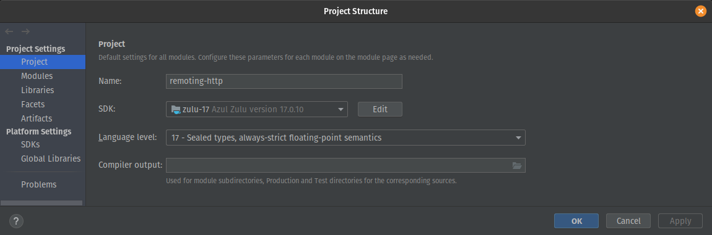

# IntelliJ Setup

The *Language level* must be set to `17` instead of `SDK default` to allow the *Run* buttons to work.



The best way to build the project is from the parent module `spring-remoting-modules`.
At the command line, or within IntelliJ, run the following command:

```shell
mvn clean install
```

This should complete successfully and allow the servers and clients in the tutorial to run.

# JDK Problem

This module failed to launch the server because of a *module related* problem with JDK17.

Switching to JDK11 avoided the problem.
